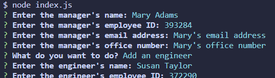
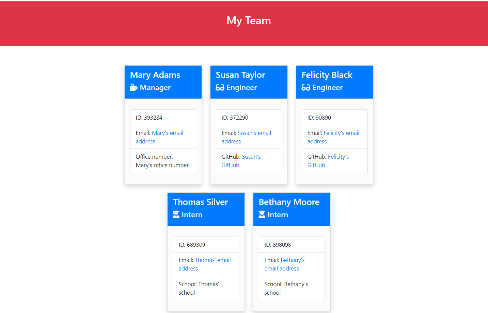

# Test-Driven-Development-Team-Profile-Generator---edX-Bootcamp-Challenge-12

This repository contains my answer to the Module 12 Challenge of the Web Development edX bootcamp. 

## Description

My task was to create a working Node.js command-line application that takes in information about employees on a software engineering team, then generates an HTML webpage that displays summaries for each person. I was provided with tests which every part of the code had to pass.

## Table of Contents

* [Installation](#installation)
* [Usage](#usage)
* [Code](#code)
* [Credits](#credits)
* [License](#license)

## Installation

The application requires the use of Node.js and the Inquirer package, and can be invoked by using the following command:

```bash
node index.js
```

## Usage

When the user enters the command above on the GitBash terminal, they will be prompted to answer questions about the team members they want to add:


</center>

A team.html file will be generated on the 'output' folder of this repository, based on the user's input. An example is available for consultation. Screenshot of the application's final look:


</center>

## Code

The development of this application used Javascript, HTML, CSS and Node.js. Jest was used for running the unit tests and Inquirer was used to collect input from the user.

## Credits

I have used Google, Github and Bootstrap documentation to research the information I needed to complete the challenge.

## License

Licensed under the MIT license.